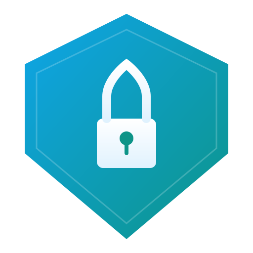

<p align="center">
  
</p>

<h1 align="center">Authagonal</h1>

<p align="center">OAuth 2.0 / OpenID Connect / SAML 2.0 authentication server backed by Azure Table Storage.</p>

Architecture: API-only ASP.NET Core server + React login SPA, packaged as a single Docker image. Can also be embedded as a library in your own ASP.NET project.

**[Documentation](https://drawboardltd.github.io/authagonal/)** · **[Live Demo](https://demo.authagonal.drawboard.com)**

## Quick Start

```bash
docker compose up
```

This starts the auth server on `http://localhost:8080` with an Azurite storage emulator.

## Projects

| Project | Description |
|---|---|
| `src/Authagonal.Core` | Domain models, interfaces, extensibility contracts |
| `src/Authagonal.Storage` | Azure Table Storage implementations |
| `src/Authagonal.Backup` | Backup, restore, merge and rollup library for Table Storage data |
| `src/Authagonal.Server` | ASP.NET Core host — OIDC, SAML, auth API, admin API |
| `login-app` | React/TypeScript login SPA (Vite), published as `@drawboard/authagonal-login` |
| `tools/Authagonal.Migration` | Duende IdentityServer → Table Storage migration tool |
| `tools/Authagonal.Backup` | Azure Table Storage backup tool (incremental support) |
| `tools/Authagonal.Restore` | Azure Table Storage restore tool (upsert, merge, clean modes) |
| `tests/Authagonal.Tests` | Unit tests |
| `demos/custom-server` | Demo: host Authagonal as a library with custom extensions |
| `demos/sample-app` | Demo: client app (API + React SPA) authenticating via Authagonal |

## Features

- **OIDC Provider** — authorization_code + PKCE, client_credentials, refresh_token grants
- **SAML 2.0 SP** — homebrew implementation, full Azure AD support
- **Dynamic OIDC Federation** — Google, Apple, Azure AD — configure via API or `appsettings.json`
- **SAML/OIDC from Config** — define identity providers in configuration, seeded on startup
- **Multi-Factor Authentication** — TOTP (authenticator apps), WebAuthn/passkeys, recovery codes. Per-client MFA policy (`Disabled`, `Enabled`, `Required`) with `IAuthHook` override for per-user control.
- **Configurable Password Policy** — min length, character requirements, exposed via API for dynamic frontend validation
- **TCC Provisioning** — Try-Confirm-Cancel provisioning into downstream apps at authorize time
- **Auth Hooks** — `IAuthHook` extensibility point for audit logging, custom validation, webhooks. Multiple implementations run in registration order.
- **Role-Based Access Control** — role CRUD, user-role assignment/removal via admin API (`/api/v1/roles`)
- **Multi-Tenant Abstractions** — `ITenantContext` and `IKeyManager` interfaces for per-tenant configuration and signing key isolation
- **Backup & Restore** — incremental backups with tombstone-based delete tracking, restore with upsert/merge/clean modes
- **Composable Library** — `AddAuthagonal()` / `UseAuthagonal()` extension methods to host in your own project
- **Session Invalidation** — SecurityStamp rotation on org change, password reset
- **SCIM 2.0 Provisioning** — inbound user/group provisioning from Entra ID, Okta, OneLogin. Per-client static Bearer tokens, soft-delete deactivation, TCC downstream triggers
- **Admin APIs** — user CRUD, SAML/OIDC provider management, token impersonation, SCIM token management
- **Brandable Login UI** — runtime-configurable branding via `branding.json`, or install the npm package and override individual components

## Deployment Options

| Option | Description |
|---|---|
| **Docker image** | `drawboardci/authagonal` — pre-built, configure via env vars and branding.json |
| **NuGet library** | Reference `Authagonal.Server` + `Authagonal.Storage`, call `AddAuthagonal()`, override services |
| **npm package** | `@drawboard/authagonal-login` — the login SPA as a component library; import base components, override what you need |

## Docker

```bash
# Build server image
docker build -t authagonal .

# Build migration tool
docker build -f Dockerfile.migration -t authagonal-migration .
```

## Development

```bash
# Server (requires .NET 10 SDK)
dotnet run --project src/Authagonal.Server

# Login app
cd login-app && npm install && npm run dev
```

## Hosting as a Library

```csharp
var builder = WebApplication.CreateBuilder(args);

// Override extensibility points before AddAuthagonal (multiple hooks supported)
builder.Services.AddSingleton<IAuthHook, MyAuditHook>();
builder.Services.AddSingleton<IEmailService, MyEmailService>();

builder.Services.AddAuthagonal(builder.Configuration);

var app = builder.Build();
app.UseAuthagonal();
app.MapAuthagonalEndpoints();
app.MapFallbackToFile("index.html");
app.Run();
```

See `demos/custom-server/` for a complete example.

## Configuration

See the [full documentation](https://drawboardltd.github.io/authagonal/) for configuration reference.

## License

[MIT](LICENSE)
